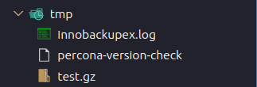

# Point in time recovery backup/restore on MySQL 5.7
## Giới thiệu
- Khôi phục đến một thời điểm cụ thể trong lịch sử cơ sở dữ liệu có thể được thực hiện bằng cách sử dụng công cụ innobackupex cùng với các binary log của máy chủ.
- `Note`: binary log sẽ chứa các thao tác đã thay đổi trong cơ sở dữ liệu từ một thời điểm trong quá khứ. Ta sẽ cần một bản full backup để làm cơ sở, sau đó áp dụng một loạt các thao tác từ các binary log để làm cho dữ liệu khớp với thời điểm mong muốn.

## Luồng hoạt động 


- Mô tả: 

    + Trên VM1, sẽ chạy công cụ backup để tạo các file nén của full backup, sau đó đẩy lên công cụ lưu trữ Ceph
    + Từ VM2, download file full backup đó về và giải nén, rồi copy hoặc mount vào thư mục dữ liệu của container để restore.
    + Trên VM1, từ binary log, tạo file sql ghi ra những thao tác trong khoảng thời gian từ bản full backup tới thời điểm mong muốn. Sau đó, tiếp tục đẩy file này lên Ceph.
    + Từ VM2, down file sql về, sau đó apply những thay đổi vào bản full backup hiện có. Ta sẽ có được dữ liệu tại thời điểm mà ta mong muốn.
  
## Chi tiết quá trình
### Mô tả kịch bản
- Vào thời điểm `2023-08-09 15:12:29`, dữ liệu được thêm vào. 
- Sau đó vào thời điểm `2023-08-09 15:37:13` thì thêm một loạt dữ liệu mới
- Tại thời điểm `2023-08-09 15:39:xx` thì lỡ tay xóa mất bảng 
-> Giờ muốn khôi phục lại tại thời điểm `2023-08-09 15:38:00` lúc sự cố vẫn chưa xảy ra.


### Trên VM1 (Tạo bản full backup và đẩy lên Ceph)
#### Backup
- File dữ liệu `01.sql`(https://github.com/vnMarcus/PITR/blob/main/inno/init/01.sql):

- File cấu hình `my-custom.cnf`:
  ``` bash
    [mysqld]
    server_id=1
    log-bin=mysql-bin
    expire_logs_days = 8
    binlog_format=row
  ```

- Chạy file `docker-compose.yml`:
    ``` bash
    version: '3.8'
    services:
        db:
            image: mysql:5.7-debian
            container_name: mysql
            command: --default-authentication-plugin=mysql_native_password
            restart: always
            environment:
                MYSQL_ROOT_PASSWORD: root
                MYSQL_INITDB_SKIP_TZINFO: 1
                MYSQL_DATABASE: mydb
                MYSQL_USER: user
                MYSQL_PASSWORD: user
                TZ: Asia/Ho_Chi_Minh
            privileged: false
            ports:
            - 3306:3306
            volumes:
            - ./init:/docker-entrypoint-initdb.d
            - ./var/lib/mysql:/var/lib/mysql:rw
            - ./my-custom.cnf:/etc/mysql/conf.d/my-custom.cnf
        backup:
        image: ndvinhcn/test:db-backup-mysql5.7
        container_name: backup
        command: ["sleep", "3600"]
        volumes:
            - ./    version: '3.8'
    services:
        backup:
        image: ndvinhcn/test:db-backup-mysql5.7
        container_name: backup
        command: ["sleep", "3600"]
        volumes:
            - ./var/lib/mysql:/var/lib/mysql:rw
            - ./tmp:/tmp
            - ./backup:/backup
    ```
- Kiểm tra dữ liệu trong `database`:
    ``` bash
    vinh@vinh-HP-Laptop-14s-dq5xxx:~/Desktop/New_version/inno$ docker exec -it mysql mysql -u root -p 
    mysql> show databases;
    +--------------------+
    | Database           |
    +--------------------+
    | information_schema |
    | mydb               |
    | mysql              |
    | performance_schema |
    | sys                |
    +--------------------+
    5 rows in set (0.00 sec)

    mysql> use mydb;
    mysql> select * from t1;
    +-----+------------+---------------------+
    | id  | name       | c_time              |
    +-----+------------+---------------------+
    |   1 | WGeAUfXHs  | 2023-08-09 15:12:29 |
    |   2 | mKiell     | 2023-08-09 15:12:29 |
    |   3 | YzKHiAAJj  | 2023-08-09 15:12:29 |
    |   4 | NxVfY      | 2023-08-09 15:12:29 |
    |   5 | BbDvEdmU   | 2023-08-09 15:12:29 |
    mysql> show grants for 'test_user'@'localhost';
    +--------------------------------------------------------+
    | Grants for test_user@localhost                         |
    +--------------------------------------------------------+
    | GRANT SELECT, INSERT ON *.* TO 'test_user'@'localhost' |
    +--------------------------------------------------------+
    1 row in set (0.00 sec)
    ```

- Lấy ra ip của container `mysql`: 
    ``` bash
    vinh@vinh-HP-Laptop-14s-dq5xxx:~/Desktop/New_version/inno$ mysql_container_id=$(docker ps -aqf "name=mysql") && mysql_ip=$(docker inspect -f '{{range .NetworkSettings.Networks}}{{.IPAddress}}{{end}}' $mysql_container_id) && echo $mysql_ip
    172.24.0.3
    ```
- Chạy lệnh sau để thực hiện backup. Nó sẽ exec vào container và chạy câu lệnh được đặt trong dấu ngoặc kép " ":
  ``` bash
  vinh@vinh-HP-Laptop-14s-dq5xxx:~/Desktop/New_version/inno$ docker exec -it backup bash -c "innobackupex --stream=xbstream --parallel=2 --user=root --password=root --host=$mysql_ip /var/lib/mysql 2> /tmp/innobackupex.log | gzip > /tmp/test.gz"
  ```
- Giải thích các tham số:
  + `innobackupex`: lệnh chính để thực hiện sao lưu và khôi phục dữ liệu của MySQL 5.7 bằng công cụ Percona XtraBackup
  +  `--stream=xbstream`: tham số này chỉ định loại dữ liệu stream được sử dụng. Khi sử dụng nó sẽ tạo một luồng chuyển đổi dữ liệu sao lưu, giúp tối ưu hóa hiệu suất và tốc độ truyền dữ liệu từ nguồn sao lưu tới đích. Ví dụ như lưu trữ hoặc nén dữ liệu
  +  `--parrallel=2`: tham số này xác định các luồng song song được thực hiện. Trong ví dụ này, có 2 luồng được sử dụng để tăng hiệu suất sao lưu.
  +  `--user=root --password=root --host=172.24.0.2`: Đây là thông tin xác thực để kết nối đến máy chủ MySQL cần backup. Trong đó, `--user` chỉ định người dùng MySQL(trong trường hợp này là root), `--password` là mật khẩu cho người dùng, `--host` là địa chỉ IP của máy chủ MySQL
  +  `var/lib/mysql`: Đường dẫn đến thư mục chứa dữ liệu MySQL muốn sao lưu
  +  `/tmp/innobackupex.log`: Chuyển hướng đầu ra của câu lệnh vào tệp `innobackupex.log` tại thư mục `tmp`.
  +  ` | gzip > /tmp/test.gz`: Phần này để chuyển dữ liệu của đầu ra của `innobackupex` sang lệnh `gzip`, sau đó nén dữ liệu và ghi vào tệp `test.gz` tại thư mục `tmp`.

- Kết quả thu được trong folder `tmp` sẽ bao gồm 1 file nén `test.gz` (bản full backup) và 1 file log ghi lại quá trình backup.



- Kiểm tra file `innobackupex.log`:
``` bash
230809 08:15:57 Executing UNLOCK TABLES
230809 08:15:57 All tables unlocked
230809 08:15:57 [00] Streaming ib_buffer_pool to <STDOUT>
230809 08:15:57 [00]        ...done
230809 08:15:57 Backup created in directory '/var/lib/mysql/'
MySQL binlog position: filename 'mysql-bin.000003', position '154'
230809 08:15:57 [00] Streaming <STDOUT>
230809 08:15:57 [00]        ...done
230809 08:15:57 [00] Streaming <STDOUT>
230809 08:15:57 [00]        ...done
xtrabackup: Transaction log of lsn (2855779) to (2855788) was copied.
230809 08:15:57 completed OK!
```
-> Như vậy đã tạo bản full backup thành công.
    + `Note`: Điều cuối cùng bạn sẽ thấy là một cái gì đó giống như sau, trong đó giá trị của `<LSN>` sẽ là một số phụ thuộc vào hệ thống của bạn
```
xtrabackup: Transaction log of lsn (<SLN>) to (<LSN>) was copied.
```
- Trước khi đẩy dữ liệu lên Ceph, sử dụng `md5sum` để có thể kiểm tra tính toàn ven của file:
``` bash
vinh@vinh-HP-Laptop-14s-dq5xxx:~/Desktop/New_version/inno$ md5sum tmp/test.gz 
5815389c2da9fee3c05bbdaf3ac0b54f  tmp/test.gz
```
- Sau đó chạy file `push_file.py`(https://github.com/vnMarcus/PITR/blob/main/inno/push_file.py):
``` bash
vinh@vinh-HP-Laptop-14s-dq5xxx:~/Desktop/New_version/inno$ python3 push_file.py 
File 'test.gz' uploaded successfully.
File '/home/vinh/Desktop/New_version/inno/test.sql' not found, upload failed.
Total 1 files uploaded successfully.
Total 1 files failed to upload.
```
-> Như vậy đã upload thành công lên Ceph.
- Hình ảnh:


### Trên VM2 (Restore bản full backup)
- Tạo thư mục để download dữ liệu:
``` bash
vinh@vinh:~/inno$ cd ~/inno/
vinh@vinh:~/inno$ mkdir tmp
vinh@vinh:~/inno$ mkdir store_data
```

- Chạy file python sau để tải bản full backup `download_file.py`(https://github.com/vnMarcus/PITR/blob/main/inno/download_file.py):
``` bash
vinh@vinh:~/inno$ python3 download_file.py 
test.gz downloaded successfully to /home/vinh/inno/store_data/test.gz
test.sql not found in the bucket.
Total 1 files downloaded successfully.
```
- Test lại tính toàn vẹn bằng cách dùng `md5sum`:
``` bash
vinh@vinh:~/inno$ md5sum ~/inno/tmp/test.gz
5815389c2da9fee3c05bbdaf3ac0b54f  /home/vinh/inno/store_data/test.gz
```

- Chạy file `docker-compose.yml`:
    ``` bash
    version: '3.8'
    services:
        backup:
        image: ndvinhcn/test:db-backup-mysql5.7
        container_name: backup
        command: ["sleep", "3600"]
        volumes:
            - ./var/lib/mysql:/var/lib/mysql:rw
            - ./tmp:/tmp
            - ./backup:/backup
    ```

- Thực hiện restore. Chạy lệnh sau để giải nén. Nó sẽ exec vào container và thực hiện lệnh được ghi trong dấu ngoặc kép:
``` bash
vinh@vinh:~/inno$ docker exec backup bash -c "gzip -d -c /tmp/test.gz | xbstream -x -C /backup/ --parallel=2 2>> /tmp/xbstream_extract.log"
```
- Giải thích các tham số:

    + `gzip`: công cụ để nén và giải nén file
    + `-d`: tham số này sử dụng khi bạn muốn giải nén
    + `-c`: y cho biết rằng kết quả của hoạt động giải nén sẽ được ghi ra luồng đầu ra chuẩn (stdout). Bạn có thể chuyển kết quả của lệnh gzip -d -c như là đầu vào cho một lệnh khác.
    + `|`:  Đây là dấu ống (pipe), cho phép đầu ra của lệnh trước (gzip) được chuyển đến đầu vào của lệnh sau (xbstream).
    + `xbstream -x -C /backup/ --parallel=2 2>> /tmp/xbstream_extract.log`: Đây là lệnh để trích xuất dữ liệu từ luồng đầu vào (được cung cấp bởi gzip) bằng công cụ xbstream.
    + `-C /backup/`: Tham số này chỉ định thư mục đích mà dữ liệu trích xuất sẽ được ghi vào. Trong trường hợp này, dữ liệu sẽ được ghi vào thư mục /backup/.
    + `--parallel=2`: Tham số này cho phép đồng thời thực hiện trích xuất trên 2 luồng, tận dụng hiệu suất của máy tính.
    + `2>> /tmp/xbstream_extract.log`: Tham số này chuyển lỗi (stderr) từ lệnh xbstream và ghi chúng vào tệp xbstream_extract.log trong thư mục /tmp.

#### Prepare
- Tiếp tục chạy lệnh này để `prepare` dữ liệu. Các tệp dữ liệu có thể không nhất quán về thời điểm, ví dụ bạn thực hiện backup khi mà một giao dịch vẫn đang thực hiện. 
- Khi chạy lệnh này, commited transaction log sẽ được apply , transaction khi chưa được commited sẽ được rollback để đảm bảo tính nhất quán của dữ liệu.
``` bash
vinh@vinh:~/inno$ docker exec backup bash -c "innobackupex --defaults-file=/backup/backup-my.cnf --ibbackup=xtrabackup --apply-log /backup/ 2> /tmp/prepare.log"
```
- Giải thích các tham số: 

    + `--defaults-file=/backup/backup-my.cnf`: Đây là tham số để chỉ định tệp cấu hình (backup-my.cnf) mà innobackupex sẽ sử dụng để đọc các cài đặt cấu hình cho quá trình sao lưu và khôi phục.
    + `--ibbackup=xtrabackup`: Tham số này xác định loại công cụ sao lưu và khôi phục sẽ được sử dụng
    + `--apply-log`: Đây là một tùy chọn để chỉ định rằng bạn đang yêu cầu quá trình "apply log" (chuẩn bị) sau khi sao lưu. Quá trình "apply log" là bước quan trọng để đảm bảo dữ liệu sao lưu có thể được khôi phục chính xác.
    + `/backup/`: Đây là đường dẫn đến thư mục chứa các tệp sao lưu.
    + `2> /tmp/prepare.log`: Tham số này chuyển hướng lỗi tiêu chuẩn (stderr) sang tệp prepare.log trong thư mục /tmp/. Tất cả các thông báo lỗi hoặc thông tin về quá trình chuẩn bị sẽ được ghi vào tệp này để bạn có thể kiểm tra sau khi thực hiện lệnh.

- Khi quá trình này kết thúc, bạn sẽ thấy tắt InnoDB với thông báo như sau, trong đó giá trị của LSN sẽ phụ thuộc vào hệ thống của bạn. Ví dụ thông tin trong file `prepare.log`:
    ``` bash
    root@b27b9a4ba6fc:/opt/trove/backup# cat /tmp/prepare.log | tail -5
    xtrabackup: starting shutdown with innodb_fast_shutdown = 1
    InnoDB: FTS optimize thread exiting.
    InnoDB: Starting shutdown...
    InnoDB: Shutdown completed; log sequence number 3290664
    230809 04:02:06 completed OK!
    ```
    + `Note`: Không nên làm gián đoạn quá trình preparing backup vì nó có thể làm tệp dữ liệu bị hỏng và bản sao lưu sẽ không thể sử dụng được nữa.

#### Restore
- Như vậy sau quá trình prepare, dữ liệu đã ở trạng thái nhất quán và sẵn sàng được khôi phục. Ta sẽ mount thư mục `backup` chứa các file dữ liệu vào thư mục `var/lib/mysql`.
- Đây là thư mục `backup` sau khi prepare:
``` bash
root@de3f150248dd:/opt/trove/backup# ls -la /backup/
total 131168
drwxr-xr-x 6  999 root     4096 Aug  9 08:31 .
drwxr-xr-x 1 root root     4096 Aug  9 08:29 ..
-rw-r----- 1  999  999       56 Aug  9 08:31 auto.cnf
-rw-r----- 1  999 root      487 Aug  9 08:30 backup-my.cnf
-rw------- 1  999  999     1680 Aug  9 08:31 ca-key.pem
-rw-r--r-- 1  999  999     1112 Aug  9 08:31 ca.pem
-rw-r--r-- 1  999  999     1112 Aug  9 08:31 client-cert.pem
-rw------- 1  999  999     1680 Aug  9 08:31 client-key.pem
-rw-r----- 1  999 root      535 Aug  9 08:30 ib_buffer_pool
-rw-r----- 1  999 root 50331648 Aug  9 09:13 ib_logfile0
-rw-r----- 1  999 root 50331648 Aug  9 08:30 ib_logfile1
-rw-r----- 1  999 root 12582912 Aug  9 09:13 ibdata1
-rw-r----- 1  999  999 12582912 Aug  9 08:31 ibtmp1
drwxr-x--- 2  999 root     4096 Aug  9 08:30 mydb
drwxr-x--- 2  999 root     4096 Aug  9 08:30 mysql
lrwxrwxrwx 1  999  999       27 Aug  9 08:31 mysql.sock -> /var/run/mysqld/mysqld.sock
drwxr-x--- 2  999 root     4096 Aug  9 08:30 performance_schema
-rw------- 1  999  999     1676 Aug  9 08:31 private_key.pem
-rw-r--r-- 1  999  999      452 Aug  9 08:31 public_key.pem
-rw-r--r-- 1  999  999     1112 Aug  9 08:31 server-cert.pem
-rw------- 1  999  999     1680 Aug  9 08:31 server-key.pem
drwxr-x--- 2  999 root    12288 Aug  9 08:30 sys
-rw-r----- 1  999 root       21 Aug  9 08:30 xtrabackup_binlog_info
-rw-r--r-- 1  999 root       23 Aug  9 08:30 xtrabackup_binlog_pos_innodb
-rw-r----- 1  999 root      135 Aug  9 08:30 xtrabackup_checkpoints
-rw-r----- 1  999 root      526 Aug  9 08:30 xtrabackup_info
-rw-r----- 1  999 root  8388608 Aug  9 08:30 xtrabackup_logfile
-rw-r--r-- 1  999 root        1 Aug  9 08:30 xtrabackup_master_key_id
```
- Chạy container `mysql-5.7` để test, mount dữ liệu vào thư mục phía trên:
``` bash
vinh@vinh:~/inno$ docker run -d --name mysql-test -e MYSQL_ROOT_PASSWORD=root -v ./backup:/var/lib/mysql/ mysql:5.7
7fa20d8f001c6bcb0201ee46e67a20bd1ec131288608cd9a1e1fda7430e1597d
```

- Test lại dữ liệu với bản full backup trên VM2:
``` bash
vinh@vinh:~/inno$ docker exec -it mysql-test mysql -u root -p

mysql> show databases;
+--------------------+
| Database           |
+--------------------+
| information_schema |
| mydb               |
| mysql              |
| performance_schema |
| sys                |
+--------------------+
5 rows in set (0.00 sec)

mysql> select * from t1 limit 5;
+----+-----------+---------------------+
| id | name      | c_time              |
+----+-----------+---------------------+
|  1 | WGeAUfXHs | 2023-08-09 15:12:29 |
|  2 | mKiell    | 2023-08-09 15:12:29 |
|  3 | YzKHiAAJj | 2023-08-09 15:12:29 |
|  4 | NxVfY     | 2023-08-09 15:12:29 |
|  5 | BbDvEdmU  | 2023-08-09 15:12:29 |
+----+-----------+---------------------+
5 rows in set (0.00 sec)


mysql> SHOW GRANTS FOR 'test_user'@'localhost';
+--------------------------------------------------------+
| Grants for test_user@localhost                         |
+--------------------------------------------------------+
| GRANT SELECT, INSERT ON *.* TO 'test_user'@'localhost' |
+--------------------------------------------------------+
1 row in set (0.00 sec)
```
-> Như vậy có thể thấy dữ liệu đã được backup thành công.

#### VM1 (Thêm dữ liệu và thực hiện sự cố)
- Tại thời điểm `2023-08-09 15:37:13` thêm dữ liệu bằng các câu lệnh được lưu trong `script.sql`(https://github.com/vnMarcus/PITR/blob/main/inno/script.sql):
- Copy file vào container:
``` bash
vinh@vinh-HP-Laptop-14s-dq5xxx:~/Desktop/New_version/inno$ docker cp script.sql mysql:/
Successfully copied 6.14kB to mysql:/
```
- Chạy container và load dữ liệu:
``` bash
vinh@vinh-HP-Laptop-14s-dq5xxx:~/Desktop/New_version/inno$ docker exec -it mysql bash
root@2d383f533c19:/# mysql -u root -p mydb < script.sql 
```
- Test lại dữ liệu:
``` bash
vinh@vinh-HP-Laptop-14s-dq5xxx:~/Desktop/New_version/inno$ docker exec -it mysql mysql -u root -p
mysql> use mydb;
mysql> select * from t1 where id = 200;
+-----+--------+---------------------+
| id  | name   | c_time              |
+-----+--------+---------------------+
| 200 | AylgGL | 2023-08-09 15:37:13 |
+-----+--------+---------------------+
1 row in set (0.00 sec)
```

- Tại thời điểm `2023-08-09 15:39:xx` thì thực hiện sự cố, bằng cách xóa bảng đó đi:
``` bash
mysql> drop table t1;
Query OK, 0 rows affected (0.00 sec)
```
- Tiếp theo, chúng ta sẽ kiểm tra các file `binary log`:
``` bash
mysql>  SHOW BINARY LOGS;
+------------------+-----------+
| Log_name         | File_size |
+------------------+-----------+
| mysql-bin.000001 |       177 |
| mysql-bin.000002 |     29827 |
| mysql-bin.000003 |     28309 |
+------------------+-----------+
3 rows in set (0.00 sec)
```
- Và:
``` bash
mysql> SHOW MASTER STATUS;
+------------------+----------+--------------+------------------+-------------------+
| File             | Position | Binlog_Do_DB | Binlog_Ignore_DB | Executed_Gtid_Set |
+------------------+----------+--------------+------------------+-------------------+
| mysql-bin.000003 |    28309 |              |                  |                   |
+------------------+----------+--------------+------------------+-------------------+
1 row in set (0.00 sec)
```
- Note:

    + Truy vấn đầu tiên cung cấp thông tin về các tệp chứa bản ghi nhị phân, câu lệnh thứ hai sẽ cho biết tệp nào đang được sử dụng để ghi lại thay đổi hiện tại, cùng với vị trí hiện tại của tệp đó. 
    + Các tệp này thường được lưu trong thư mục `var/lib/mysql`(trừ khi vị trí khác được chỉ định khi máy chủ được khởi động với tùy chọn --log-bin=).

- Để biết được ví trị của bản full backup, cuối cùng, ta sẽ lấy thông tin ở `xtrabackup_binlog_info`:
``` bash
    # Giải nén thư mục backup
    docker exec backup bash -c "gzip -d -c /tmp/test.gz | xbstream -x -C /backup/ --parallel=2 2>> /tmp/xbstream_extract.log"
    # exec vào container
    vinh@vinh-HP-Laptop-14s-dq5xxx:~/Desktop/New_version/inno$ docker exec -it backup bash
    # hiển thị thông tin bên trong xtrabackup_binglog_info
    root@d38f8b5d6101:/opt/trove/backup# cat /backup/xtrabackup_binlog_info 
    mysql-bin.000003        154
```
- `mysql-bin.000003` là tên của tệp bản ghi nhật ký nhị phân (binary log) và `57` là vị trí (position) trong tệp đó. Giải thích:

    + Trong hệ thống MySQL, các thay đổi dữ liệu được ghi lại trong các tệp bản ghi nhật ký nhị phân. Mỗi tệp bản ghi nhật ký có tên theo một quy tắc cụ thể, ví dụ `mysql-bin.000001`, `mysql-bin.000002`, và tiếp tục như vậy. Số cuối cùng trong tên tệp đại diện cho số thứ tự của tệp.
    + Vị trí (position) là một con số, thường là một giá trị số nguyên, thể hiện vị trí cụ thể trong tệp bản ghi nhật ký. Khi dữ liệu thay đổi được ghi vào tệp bản ghi nhật ký, vị trí này tăng lên tương ứng với số lượng dữ liệu đã được ghi.

- Như vậy ta có thể dựa vào 2 thông tin trên để lấy mốc thời điểm bắt đầu khôi phục cho quá trình Point in time. Để hiểu rõ hơn, ta sẽ xem thử bên trong file  `mysql-bin.000003`:
``` bash
vinh@vinh-HP-Laptop-14s-dq5xxx:~/Desktop/New_version/inno$ docker exec -it mysql bash
root@3c7d7c97861b:/# mysqlbinlog --base64-output=decode-rows -vv /var/lib/mysql/mysql-bin.000003 | tail -15
# at 28129
#230809 15:39:28 server id 1  end_log_pos 28194 CRC32 0x321e57d3        Anonymous_GTID  last_committed=100      sequence_number=101rbr_only=no
SET @@SESSION.GTID_NEXT= 'ANONYMOUS'/*!*/;
# at 28194
#230809 15:39:28 server id 1  end_log_pos 28309 CRC32 0x9c70993b        Query   thread_id=6     exec_time=0     error_code=0
use `mydb`/*!*/;
SET TIMESTAMP=1691570368/*!*/;
SET @@session.pseudo_thread_id=6/*!*/;
DROP TABLE `t1` /* generated by server */
/*!*/;
SET @@SESSION.GTID_NEXT= 'AUTOMATIC' /* added by mysqlbinlog */ /*!*/;
DELIMITER ;
# End of log file
/*!50003 SET COMPLETION_TYPE=@OLD_COMPLETION_TYPE*/;
/*!50530 SET @@SESSION.PSEUDO_SLAVE_MODE=0*/;
```
-> Có thể thấy tại vị trí `28194`, câu lệnh `Drop table t1` được thực thi. 
- Như vậy, ta sẽ có 2 lựa chọn để khôi phục 
  
    + Cách thứ nhất là từ điểm mốc nói trên, đến trước khi câu lệnh DROP thực thi, tức là tại ví trí `28194`
    + Cách thức hai là từ thời điểm mốc nói trên, đến khoảng thời gian `2023-08-09 15:38:00`
-> Ở đây ta sẽ thử với cách 2.


- Tạo file sql đến thời điểm cần khôi phục sử dụng công cụ `mysqlbinlog`:

``` bash
vinh@vinh-HP-Laptop-14s-dq5xxx:~/Desktop/New_version/inno$     docker exec -it mysql bash
root@3c7d7c97861b:/# mysqlbinlog /var/lib/mysql/mysql-bin.000003 --start-position=154 --stop-datetime="2023-08-09 15:38:00" > test.sql
```

- File `test.sql`(https://github.com/vnMarcus/PITR/blob/main/inno/test.sql):

- Chuyển dữ liệu ra máy host:
``` bash
docker cp mysql:/test.sql /home/vinh/Desktop/New_version/inno/test.sql
```

- Upload `test.sql` lên `Ceph`:

``` bash
vinh@vinh-HP-Laptop-14s-dq5xxx:~/Desktop/New_version/inno$ python3 push_file.py 
File 'test.gz' already exists on S3, skipping upload.
File 'test.sql' uploaded successfully.
Total 1 files uploaded successfully.
```
- Tiếp tục sử dụng cơ chế `md5sum` để test tính toàn vẹn:

``` bash
vinh@vinh-HP-Laptop-14s-dq5xxx:~/Desktop/New_version/inno$ md5sum test.sql
bedb689259b9b0ca91016723cfa9f257  test.sql
```

- Lúc này các file trên `Ceph`:


#### VM2(Chuyển sang `restore` trên máy VM2)

- Download file về:
``` bash
vinh@vinh:~/inno$ python3 download_file.py 
test.gz already exists locally, skipping download.
test.sql downloaded successfully to /home/vinh/inno/store_data/test.sql
Total 1 files downloaded successfully.
```
- Dùng `md5sum` để kiểm tra tính toàn vẹn:
``` bash
vinh@vinh:~/inno$ md5sum store_data/test.sql 
bedb689259b9b0ca91016723cfa9f257  store_data/test.sql
```
-> Như vậy đã giống nhau.
- Thực hiện restore:
``` bash
# Copy file vào container
vinh@vinh:~/inno$ docker cp ./store_data/test.sql mysql-test:/
Successfully copied 94.2kB to mysql-test:/
# Load dữ liệu
vinh@vinh:~/inno$ docker exec -it mysql-test bash
bash-4.2# mysql -u root -p mydb < test.sql 
```

- Kiểm tra lại dữ liệu:
``` bash
bash-4.2# mysql -u root -p

mysql> select * from t1 where id = 200;
+-----+--------+---------------------+
| id  | nammaingGL | 2023-08-09 15:37:13 |
+-----+--------+---------------------+
1 row in set (0.00 sec)
```
-> Như vậy đã khôi phục được liệu tại thời điểm `2023-08-09 15:37:13`.


# Tài liệu tham khảo
- Full backup: https://docs.percona.com/percona-xtrabackup/2.4/backup_scenarios/full_backup.html#preparing-a-backup
- Point in time recovery/backup: https://docs.percona.com/percona-xtrabackup/2.4/innobackupex/pit_recovery_ibk.html
- Kết hợp với phần Binary log trong quyển `The_DevOps_Guide_to_Database_Backups_for_MySQL_and_MariaDB`
