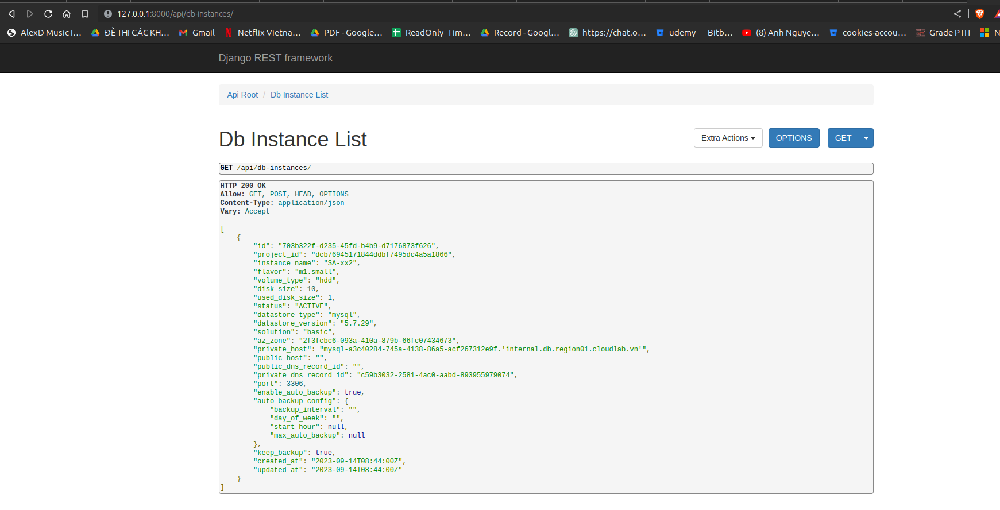
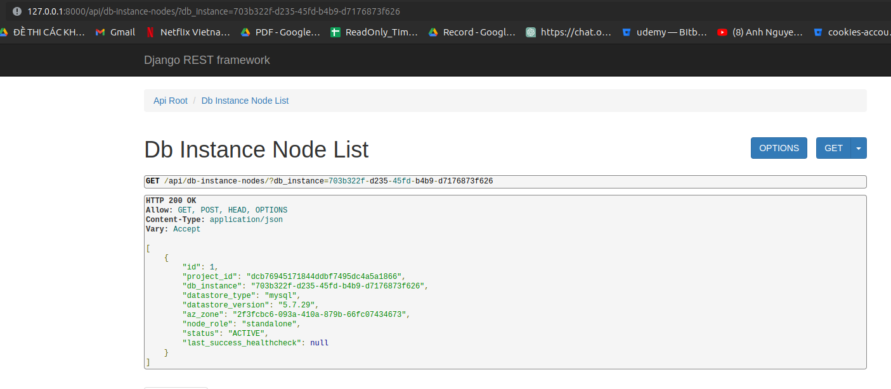
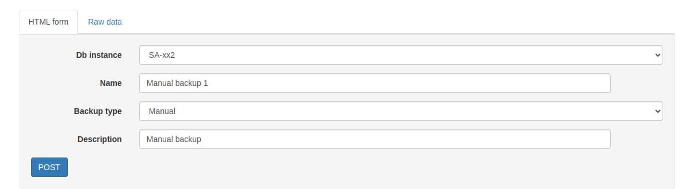
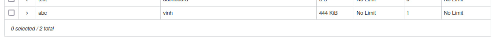
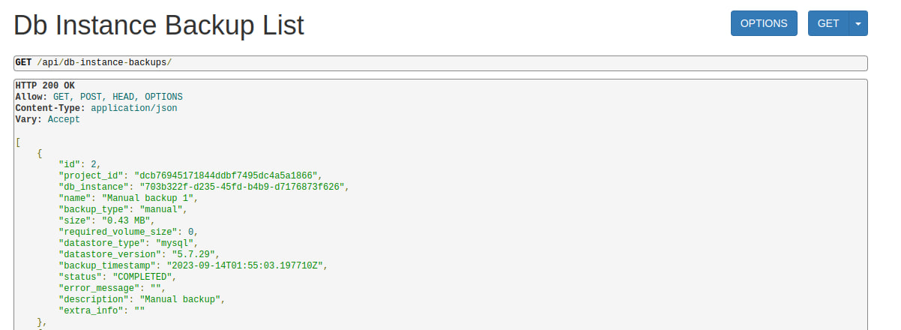
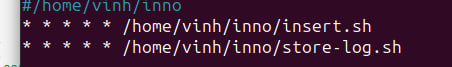
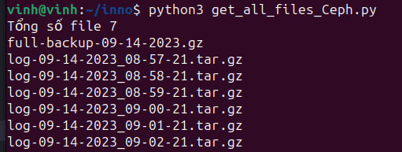
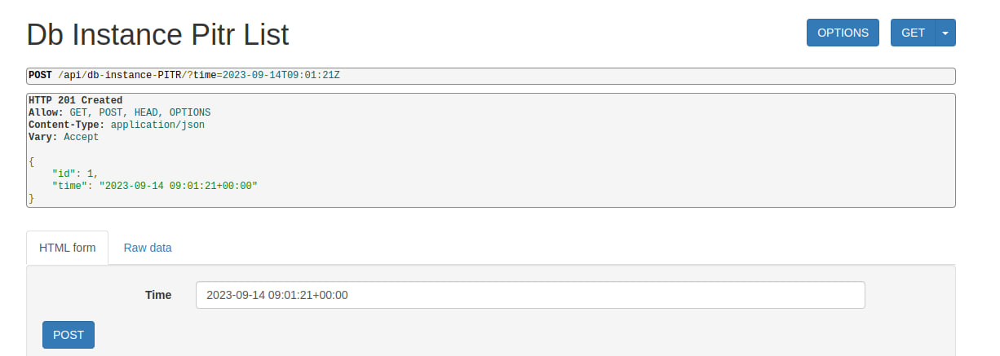
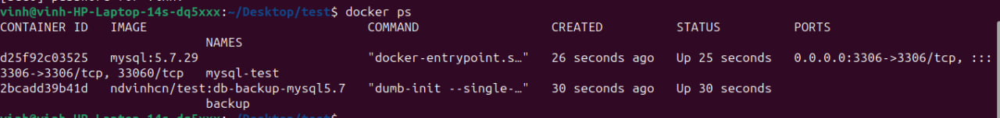
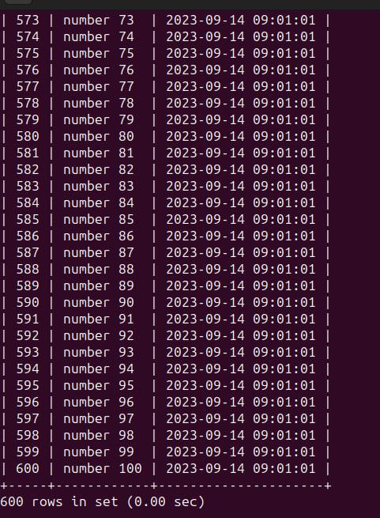

- Luồng hoạt động chính:

    + Sẽ có 2 con VM, con VM1 sẽ lưu trữ dữ liệu, và con VM2 sẽ dùng để khôi phục dữ liệu. 

    + Các bản full backup và binary log sẽ được nén và đẩy lên Ceph.

### API lấy danh sách các DB Instance

### API lấy danh sách các DB Instance Node của một DB Instance

### API tạo bản Backup

- API sẽ tạo bản backup thủ công bằng tay:

- Kết quả sau khi thực hiện API:

- FIle `full backup` được đẩy lên Ceph

- Kết quả khi dùng API để lấy ra các danh sách backup

### Lập lịch dùng linux
- Sau mỗi phút sẽ thêm 100 bản ghi dữ liệu vào(dữ liệu sẽ gồm 2 cột, cột thứ nhất `number` từ 1 đến 100, cột thứ 2 là thời gian dữ liệu đó được thêm vào)
- Sau khi thêm dữ liệu thì sẽ chạy file `store-log.sh`: nó sẽ `flush log`, sau đó sẽ lấy các file binary log sinh ra trong khoảng 1 phút rồi nén lại -> đẩy lên Ceph.

- Kết quả sau vài phút thu được:

    + Một bản `full backup`
    + Các bản binary log được sinh ra trong mỗi phút

### API nhập vào một khoảng thời gian và khôi phục về thời điểm đó 

- Khoảng thời gian nhập vào là `2023-09-14 09:01:21` và sau đó dữ liệu sẽ được khôi phục về khoảng thời gian đó.

- Kiểm tra dữ liệu:
  
    + Container thu được: 

    + Kiểm tra dữ liệu sau đó: 

-> Như vậy đã khôi phục được dữ liệu về khoảng thời gian cần khôi phục.