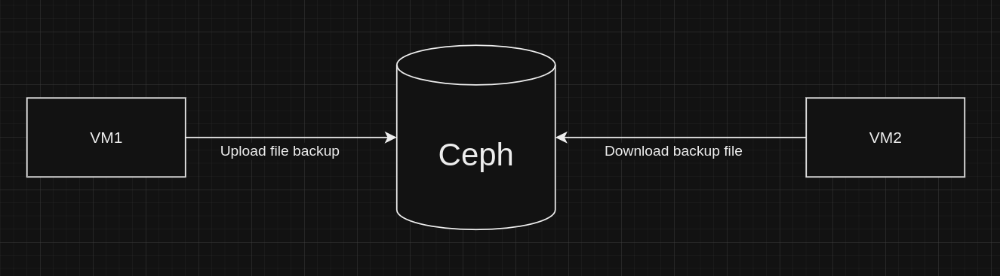

# Percona XtraBackup 2.4 for MySql 5.7
## Giới thiệu
- Quá trình backup/restore trải qua nhiều bước, sau đây là kết quả bản thử nghiệm và những thay đổi sau từng bước.
- Mục đích tìm hiểu, trả lời được những câu hỏi sau: 

    + Nó dùng cơ chế gì để copy dữ liệu ?
    + Nó có khóa không ?
    + Người dùng muốn backup tại thời điểm A(X1,X2), mà trong quá trình copy thì dữ liệu vẫn được thêm vào, sau khi backup, thì dữ liệu tại điểm kết thúc quá trình backup B thì dữ liệu có còn là B(X1, X2) không ? Hay thay đổi như nào ?
## Luồng hoạt động 


- Mô tả: 

    + Trên VM1, sẽ tạo bản full backup sử dụng Percona Xtrabackup 2.4, sau đó đẩy lên Ceph
    + Trên VM2, download bản backup về và thực hiện restore để thấy được sự khác biết trong quá trình backup và restore.
  
## Chi tiết quá trình
### Mô tả kịch bản
- Trên máy VM1, sẽ dùng câu lệnh để thực hiện backup
- Trong thời gian đó, vẫn `insert` thêm dữ liệu(INSERT INTO t1 (name) VALUES ('number 1'); ) với 1000 bản ghi
- Kiểm tra tại sau khi giải nén file `backup` xong thì dữ liệu sẽ thế nào ? Và sau khi thực hiện bước `prepare` thì dữ liệu sẽ như nào ?

### Trên VM1 (Tạo bản full backup và đẩy lên Ceph)
#### Backup
- File dữ liệu `01.sql`:
- Chạy file `docker-compose.yml`:
    ``` bash
    version: '3.8'
    services:
        db:
            image: mysql:5.7-debian
            container_name: mysql
            command: --default-authentication-plugin=mysql_native_password
            restart: always
            environment:
                MYSQL_ROOT_PASSWORD: root
                MYSQL_INITDB_SKIP_TZINFO: 1
                MYSQL_DATABASE: mydb
                MYSQL_USER: user
                MYSQL_PASSWORD: user
                TZ: Asia/Ho_Chi_Minh
            privileged: false
            ports:
            - 3306:3306
            volumes:
            - ./init:/docker-entrypoint-initdb.d
            - ./var/lib/mysql:/var/lib/mysql:rw
            - ./my-custom.cnf:/etc/mysql/conf.d/my-custom.cnf
        backup:
        image: ndvinhcn/test:db-backup-mysql5.7
        container_name: backup
        command: ["sleep", "3600"]
        volumes:
            - ./    version: '3.8'
    services:
        backup:
        image: ndvinhcn/test:db-backup-mysql5.7
        container_name: backup
        command: ["sleep", "3600"]
        volumes:
            - ./var/lib/mysql:/var/lib/mysql:rw
            - ./tmp:/tmp
            - ./backup:/backup
    ```
- Kiểm tra dữ liệu trong `database`:
    ``` bash
    mysql> SELECT * FROM t1  LIMIT 10;
    +----+-------------+---------------------+
    | id | name        | c_time              |
    +----+-------------+---------------------+
    |  1 | Random Name | 2023-08-15 08:44:36 |
    |  2 | Random Name | 2023-08-15 08:44:36 |
    |  3 | Random Name | 2023-08-15 08:44:36 |
    |  4 | Random Name | 2023-08-15 08:44:36 |
    |  5 | Random Name | 2023-08-15 08:44:36 |
    |  6 | Random Name | 2023-08-15 08:44:36 |
    |  7 | Random Name | 2023-08-15 08:44:36 |
    |  8 | Random Name | 2023-08-15 08:44:36 |
    |  9 | Random Name | 2023-08-15 08:44:36 |
    | 10 | Random Name | 2023-08-15 08:44:36 |
    +----+-------------+---------------------+
    10 rows in set (0.00 sec)
    ```

- Lấy ra ip của container `mysql`: 
    ``` bash
    vinh@vinh-HP-Laptop-14s-dq5xxx:~/Desktop/New_version/inno$ mysql_container_id=$(docker ps -aqf "name=mysql") && mysql_ip=$(docker inspect -f '{{range .NetworkSettings.Networks}}{{.IPAddress}}{{end}}' $mysql_container_id) && echo $mysql_ip
    172.24.0.3
    ```
- Chạy lệnh sau để thực hiện backup. Nó sẽ exec vào container và chạy câu lệnh được đặt trong dấu ngoặc kép " ":
  ``` bash
  vinh@vinh-HP-Laptop-14s-dq5xxx:~/Desktop/New_version/inno$ docker exec -it backup bash -c "innobackupex --stream=xbstream --parallel=2 --user=root --password=root --host=$mysql_ip /var/lib/mysql 2> /tmp/innobackupex.log | gzip > /tmp/test.gz"
  ```
### Tiếp tục thêm dữ liệu trong file script.sql vào container trong quá trình backup

- Kết quả thu được trong folder `tmp` sẽ bao gồm 1 file nén `test.gz` (bản full backup) và 1 file log ghi lại quá trình backup.


- Kiểm tra file `innobackupex.log`:
``` bash
230809 08:15:57 Executing UNLOCK TABLES
230809 08:15:57 All tables unlocked
230809 08:15:57 [00] Streaming ib_buffer_pool to <STDOUT>
230809 08:15:57 [00]        ...done
230809 08:15:57 Backup created in directory '/var/lib/mysql/'
MySQL binlog position: filename 'mysql-bin.000003', position '154'
230809 08:15:57 [00] Streaming <STDOUT>
230809 08:15:57 [00]        ...done
230809 08:15:57 [00] Streaming <STDOUT>
230809 08:15:57 [00]        ...done
xtrabackup: Transaction log of lsn (2855779) to (2855788) was copied.
230809 08:15:57 completed OK!
```
-> Như vậy đã tạo bản full backup thành công.


- Upload file lên `Ceph`:


### Trên VM2 (Restore bản full backup)
- Tạo thư mục để download dữ liệu:
``` bash
vinh@vinh:~/inno$ cd ~/inno/
vinh@vinh:~/inno$ mkdir tmp
```

- Chạy file python sau để tải bản full backup `download_file.py`:
``` bash
vinh@vinh:~/inno$ python3 download_file.py 
test.gz downloaded successfully to /home/vinh/inno/store_data/test.gz
test.sql not found in the bucket.
Total 1 files downloaded successfully.
```

- Chạy file `docker-compose.yml`:
    ``` bash
    version: '3.8'
    services:
        backup:
        image: ndvinhcn/test:db-backup-mysql5.7
        container_name: backup
        command: ["sleep", "3600"]
        volumes:
            - ./var/lib/mysql:/var/lib/mysql:rw
            - ./tmp:/tmp
            - ./backup:/backup
    ```

# Thực hiện restore với folder `backup` được giải nén ra mà chưa được thực hiện `prepare`
- Chạy lệnh sau để giải nén file `test.gz`. Nó sẽ exec vào container và thực hiện lệnh được ghi trong dấu ngoặc kép:
``` bash
vinh@vinh:~/inno$ docker exec backup bash -c "gzip -d -c /tmp/test.gz | xbstream -x -C /backup/ --parallel=2 2>> /tmp/xbstream_extract.log"
```

- Lúc này folder `backup`:
``` bash
    root@c7d0ee8ecef6:/opt/trove/backup# ls -la /backup/
    total 123348
    drwxr-xr-x 6  999 root     4096 Aug 15 02:34 .
    drwxr-xr-x 1 root root     4096 Aug 15 02:28 ..
    -rw-r----- 1  999  999       56 Aug 15 02:34 auto.cnf
    -rw-r----- 1  999 root      487 Aug 15 02:29 backup-my.cnf
    -rw------- 1  999  999     1680 Aug 15 02:34 ca-key.pem
    -rw-r--r-- 1  999  999     1112 Aug 15 02:34 ca.pem
    -rw-r--r-- 1  999  999     1112 Aug 15 02:34 client-cert.pem
    -rw------- 1  999  999     1680 Aug 15 02:34 client-key.pem
    -rw-r----- 1  999 root    17539 Aug 15 02:29 ib_buffer_pool
    -rw-r----- 1  999  999 50331648 Aug 15 02:34 ib_logfile0
    -rw-r----- 1  999  999 50331648 Aug 15 02:34 ib_logfile1
    -rw-r----- 1  999 root 12582912 Aug 15 02:34 ibdata1
    -rw-r----- 1  999  999 12582912 Aug 15 02:34 ibtmp1
    drwxr-x--- 2  999 root     4096 Aug 15 02:29 mydb
    drwxr-x--- 2  999 root     4096 Aug 15 02:29 mysql
    lrwxrwxrwx 1  999  999       27 Aug 15 02:34 mysql.sock -> /var/run/mysqld/mysqld.sock
    drwxr-x--- 2  999 root     4096 Aug 15 02:29 performance_schema
    -rw------- 1  999  999     1680 Aug 15 02:34 private_key.pem
    -rw-r--r-- 1  999  999      452 Aug 15 02:34 public_key.pem
    -rw-r--r-- 1  999  999     1112 Aug 15 02:34 server-cert.pem
    -rw------- 1  999  999     1680 Aug 15 02:34 server-key.pem
    drwxr-x--- 2  999 root    12288 Aug 15 02:29 sys
    -rw-r----- 1  999 root       24 Aug 15 02:29 xtrabackup_binlog_info
    -rw-r----- 1  999 root      144 Aug 15 02:29 xtrabackup_checkpoints
    -rw-r----- 1  999 root      531 Aug 15 02:29 xtrabackup_info
    -rw-r----- 1  999 root   371712 Aug 15 02:29 xtrabackup_logfile

```

- Và dữ liệu lúc này:
``` bash
    mysql> SELECT * FROM t1 ORDER BY id DESC LIMIT 10;
    +----------+------------+---------------------+
    | id       | name       | c_time              |
    +----------+------------+---------------------+
    | 20470410 | number 512 | 2023-08-15 09:00:04 |
    | 20470409 | number 511 | 2023-08-15 09:00:04 |
    | 20470408 | number 510 | 2023-08-15 09:00:04 |
    | 20470407 | number 509 | 2023-08-15 09:00:04 |
    | 20470406 | number 508 | 2023-08-15 09:00:04 |
    | 20470405 | number 507 | 2023-08-15 09:00:04 |
    | 20470404 | number 506 | 2023-08-15 09:00:04 |
    | 20470403 | number 505 | 2023-08-15 09:00:04 |
    | 20470402 | number 504 | 2023-08-15 09:00:04 |
    | 20470401 | number 503 | 2023-08-15 09:00:04 |
    +----------+------------+---------------------+
    10 rows in set, 488 warnings (0.01 sec)
```

### Như vậy có thể thấy dữ liêu được thêm vào trong lúc backup thì vẫn được copy sang nhưng nó chỉ đến bản ghi thứ 512.

# Thực hiện restore với folder `backup` sau khi đã được thực hiện `prepare`
#### Prepare
- Tiếp tục chạy lệnh này để `prepare` dữ liệu. Các tệp dữ liệu có thể không nhất quán về thời điểm, ví dụ bạn thực hiện backup khi mà một giao dịch vẫn đang thực hiện. 
- Khi chạy lệnh này, commited transaction log sẽ được apply , transaction khi chưa được commited sẽ được rollback để đảm bảo tính nhất quán của dữ liệu.

``` bash
vinh@vinh:~/inno$ docker exec backup bash -c "innobackupex --defaults-file=/backup/backup-my.cnf --ibbackup=xtrabackup --apply-log /backup/ 2> /tmp/prepare.log"
```
- Khi quá trình này kết thúc, bạn sẽ thấy tắt InnoDB với thông báo như sau, trong đó giá trị của LSN sẽ phụ thuộc vào hệ thống của bạn. Ví dụ thông tin trong file `prepare.log`:
    ``` bash
    root@b27b9a4ba6fc:/opt/trove/backup# cat /tmp/prepare.log | tail -5
    xtrabackup: starting shutdown with innodb_fast_shutdown = 1
    InnoDB: FTS optimize thread exiting.
    InnoDB: Starting shutdown...
    InnoDB: Shutdown completed; log sequence number 3290664
    230809 04:02:06 completed OK!
    ```
    + `Note`: Không nên làm gián đoạn quá trình preparing backup vì nó có thể làm tệp dữ liệu bị hỏng và bản sao lưu sẽ không thể sử dụng được nữa.

- Sau quá trình `prepare`:
``` bash
root@23022c55bd03:/opt/trove/backup# ls -la /backup/
total 131180
drwxr-xr-x 6  999 root     4096 Aug 15 07:15 .
drwxr-xr-x 1 root root     4096 Aug 15 07:12 ..
-rw-r----- 1  999  999       56 Aug 15 07:15 auto.cnf
-rw-r----- 1  999 root      487 Aug 15 07:13 backup-my.cnf
-rw------- 1  999  999     1680 Aug 15 07:15 ca-key.pem
-rw-r--r-- 1  999  999     1112 Aug 15 07:15 ca.pem
-rw-r--r-- 1  999  999     1112 Aug 15 07:15 client-cert.pem
-rw------- 1  999  999     1680 Aug 15 07:15 client-key.pem
-rw-r----- 1  999 root    15681 Aug 15 07:13 ib_buffer_pool
-rw-r----- 1  999 root 50331648 Aug 15 07:15 ib_logfile0
-rw-r----- 1  999 root 50331648 Aug 15 07:13 ib_logfile1
-rw-r----- 1  999 root 12582912 Aug 15 07:15 ibdata1
-rw-r----- 1  999  999 12582912 Aug 15 07:15 ibtmp1
drwxr-x--- 2  999 root     4096 Aug 15 07:13 mydb
drwxr-x--- 2  999 root     4096 Aug 15 07:13 mysql
lrwxrwxrwx 1  999  999       27 Aug 15 07:15 mysql.sock -> /var/run/mysqld/mysqld.sock
drwxr-x--- 2  999 root     4096 Aug 15 07:13 performance_schema
-rw------- 1  999  999     1676 Aug 15 07:15 private_key.pem
-rw-r--r-- 1  999  999      452 Aug 15 07:15 public_key.pem
-rw-r--r-- 1  999  999     1112 Aug 15 07:15 server-cert.pem
-rw------- 1  999  999     1680 Aug 15 07:15 server-key.pem
drwxr-x--- 2  999 root    12288 Aug 15 07:13 sys
-rw-r----- 1  999 root       24 Aug 15 07:13 xtrabackup_binlog_info
-rw-r--r-- 1  999 root       24 Aug 15 07:13 xtrabackup_binlog_pos_innodb
-rw-r----- 1  999 root      144 Aug 15 07:13 xtrabackup_checkpoints
-rw-r----- 1  999 root      531 Aug 15 07:13 xtrabackup_info
-rw-r----- 1  999 root  8388608 Aug 15 07:13 xtrabackup_logfile
-rw-r--r-- 1  999 root        1 Aug 15 07:13 xtrabackup_master_key_id
```

- Và dữ liệu sau khi `prepare`:
``` bash
mysql> SELECT * FROM t1 ORDER BY id DESC LIMIT 10;
+----------+-------------+---------------------+
| id       | name        | c_time              |
+----------+-------------+---------------------+
| 20470898 | number 1000 | 2023-08-15 14:02:32 |
| 20470897 | number 999  | 2023-08-15 14:02:32 |
| 20470896 | number 998  | 2023-08-15 14:02:32 |
| 20470895 | number 997  | 2023-08-15 14:02:32 |
| 20470894 | number 996  | 2023-08-15 14:02:32 |
| 20470893 | number 995  | 2023-08-15 14:02:32 |
| 20470892 | number 994  | 2023-08-15 14:02:32 |
| 20470891 | number 993  | 2023-08-15 14:02:32 |
| 20470890 | number 992  | 2023-08-15 14:02:32 |
| 20470889 | number 991  | 2023-08-15 14:02:32 |
+----------+-------------+---------------------+
10 rows in set (0.00 sec)
```

### Kết quả cho thấy:

- Trong quá trình backup, mình insert thêm 1000 dòng dữ liệu. Sau khi có được thư mục nén, nếu mình giải nén ngay lập tức, thì lúc đó dữ liệu được thêm vào mysql sẽ là khoảng hơn 500 dòng.
- Sau khi thực hiện `prepare`, thì dữ liệu đã được thêm 1000 dòng, nó đã thực hiện `crash recovery` để dữ liệu được consistent.

- Kết luận tạm thời: 

    + Nó sử dụng cơ chế `Copy on write` để copy dữ liệu.
    + Nó không khóa, dữ liệu vẫn có thể thay đổi trong quá trình backup. Chính vì vậy như trên `docs`, Percona XtraBackup cũng đã khẳng định dữ liệu sau khi thực hiện `backup` thì nó là inconsistent, và cần phải thực hiện thêm bước `prepare`.

# Tài liệu tham khảo
- Docs: https://docs.percona.com/percona-xtrabackup/2.4/how_xtrabackup_works.html


- The DevOps Guide to Database Backupsfor MySQL and MariaDB


# Thắc mắc 
- https://backup.ninja/news/hot-warm-and-cold-backups-mysql
- Như ở trên trang trên, nó có nhắc đến một nhược điểm của `hot` backup là nếu dữ liệu đang được sao lưu bị thay đổi theo bất kỳ cách nào trong khi tiến hành sao lưu, thì bản sao lưu đó có thể không giống với phiên bản cuối cùng của dữ liệu trong cơ sở dữ liệu. Thì Percona Xtrabackup đang có cơ chế để thực hiện cái điều đó, giúp cho dữ liệu sau khi backup giống với bản cuối cùng trong cơ sở dữ liệu.
- Thắc mắc của em là: vậy khi backup thì lấy dữ liệu tại thời điểm bắt đầu `backup` hay tại điểm `backup` hoàn thành thì tốt hơn ?
